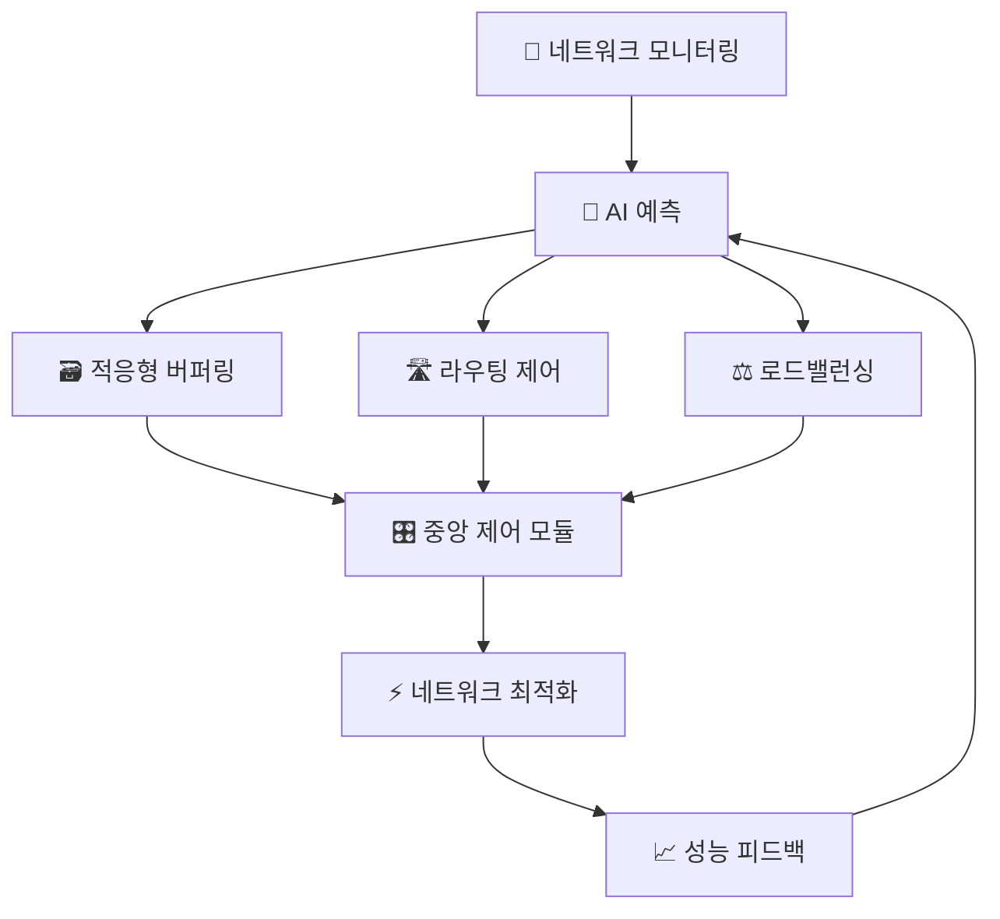

# 🤖 Agentic AI 기반 네트워크 데이터 유실 및 지연 방지 시스템(샘플)

> **AI 에이전트들이 협업하여 네트워크를 실시간으로 관리하는 차세대 네트워크 관리 시스템**

[](https://www.python.org/)
[](LICENSE)
[](https://github.com)

## 📋 목차

- [개요](#-개요)
- [핵심 특징](#-핵심-특징)
- [시스템 아키텍처](#-시스템-아키텍처)
- [설치 및 실행](#-설치-및-실행)
- [사용법](#-사용법)
- [기술적 구현](#-기술적-구현)
- [라이선스](#-라이선스)

## 🎯 개요

현대의 네트워크 환경에서는 데이터 트래픽의 급격한 증가와 네트워크 토폴로지의 복잡화로 인해 **데이터 유실 및 전송 지연 문제**가 빈번하게 발생하고 있습니다. 

본 시스템은 **Agentic AI 기술**을 활용하여 이러한 문제들을 **사전에 예방**하고 **실시간으로 최적화**하는 서비스입니다.

### 🚫 기존 시스템의 문제점

- **반응적 대응의 한계**: 장애 발생 후 대응하는 사후 처리 방식
- **정적 임계값 기반**: 동적 네트워크 환경에 적응하지 못하는 고정된 규칙
- **단편적 분석**: 개별 구성 요소만 모니터링하여 전체적 상황 파악 불가

### ✅ 본 시스템의 해결책

- **🔮 사전 예방적 대응**: AI 기반 예측을 통한 선제적 문제 해결
- **🤖 다중 AI 협업**: 4개의 전문 AI 에이전트가 각자 역할을 수행하며 협력
- **⚡ 실시간 최적화**: 밀리초 단위의 빠른 의사결정과 자동 실행

## 🌟 핵심 특징

### 📊 **실시간 모니터링 & 예측**
- **8차원 네트워크 메트릭** 실시간 수집 (RTT, Queue Length, Packet Loss 등)
- **LSTM 기반 예측 AI**로 미래 30초간의 네트워크 상태 예측
- **시계열 분석**을 통한 트렌드 및 패턴 인식

### 🤝 **다중 AI 에이전트 협업**
- **🔮 예측 AI 에이전트**: LSTM 네트워크 기반 상태 예측
- **🛣️ 라우팅 AI 에이전트**: 강화학습 알고리즘으로 최적 경로 결정
- **⚖️ 로드밸런싱 AI 에이전트**: 동적 가중치 기반 트래픽 분산
- **🗃️ 적응형 버퍼링 관리**: 지연에 따른 버퍼 크기 자동 조정

### 🎛️ **중앙 제어 & 조정**
- **AI 에이전트 간 협업 조정**: 의사결정 충돌 해결 및 우선순위 관리
- **실행 계획 수립**: 최적화된 순서로 네트워크 제어 실행
- **피드백 루프**: 실행 결과를 바탕으로 지속적 학습 및 개선

## 🏗️ 시스템 아키텍처



### 🔄 **데이터 처리 흐름**

1. **📊 데이터 수집** → 실시간 네트워크 메트릭 수집
2. **🔮 AI 예측** → LSTM으로 미래 상태 예측  
3. **🎯 다중 에이전트 의사결정** → 3개 AI 에이전트 병렬 처리
4. **🎛️ 중앙 조정** → 결과 통합 및 실행 계획 수립
5. **⚡ 자동 실행** → 네트워크 최적화 실행
6. **📈 피드백** → 성능 분석 및 모델 업데이트

## 🚀 설치 및 실행

### 📋 요구사항

- **Python 3.7+**
- **NumPy** (수치 계산)
- **기본 Python 라이브러리** (time, random, collections, json)

### 💾 설치

```bash
# 1. 저장소 클론
git clone https://github.com/your-username/agentic-ai-network-system.git
cd agentic-ai-network-system

# 2. 필요한 라이브러리 설치
pip install numpy

# 3. 시스템 실행
python agentic_ai_system.py
```

### ⚡ 빠른 시작

```bash
# 기본 데모 실행
python agentic_ai_system.py
# 선택: 1 (기본 데모)

# 위기 상황 시뮬레이션
python agentic_ai_system.py  
# 선택: 2 (네트워크 위기 상황)
```

## 📖 사용법

### 🎮 **5가지 실행 모드**

| 모드 | 설명 | 사용 사례 |
|------|------|-----------|
| **1. 기본 데모** | 단일/연속 주기 실행 | 시스템 기본 동작 확인 |
| **2. 위기 시뮬레이션** | 네트워크 위기 상황 대응 | AI 협업 위기 대응 능력 테스트 |
| **3. 구성요소 분석** | 시스템 구조 및 역할 분석 | 아키텍처 이해 및 학습 |
| **4. 성능 벤치마크** | 다양한 시나리오 성능 측정 | 시스템 성능 평가 |
| **5. 설정 파일 생성** | 커스터마이징 가능한 설정 생성 | 실제 환경 배포 준비 |

### 📊 **실행 예시**

```bash
🚀 Agentic AI 네트워크 시스템 시작!
📡 네트워크 모니터링 모듈 초기화...
🤖 예측 AI 에이전트 초기화...
🛣️ 라우팅 AI 에이전트 초기화...

🔄 처리 주기 #1 시작
📊 수집된 데이터: RTT=12.3ms, 큐=1350, 손실=0.023%
🔮 예측 결과: 지연=15.2ms, 손실=0.035%, 혼잡도=0.82
🛣️ 경로 변경: Route_A → Route_B (비용: 6.61)
⚖️ 트래픽 분산: Server_1: 318 req/s, Server_2: 91 req/s
🗃️ 버퍼 크기 조정: 2000kb → 2553kb (+27.7%)
⚡ 실행 완료 시간: 0.003초
```

## 🔬 기술적 구현

### 🧠 **AI 알고리즘**

#### **1. LSTM 예측 모델**
```python
# 명세서 공식 구현
h_t = LSTM(x_t, h_{t-1})  # 은닉 상태 업데이트
y_t = W_h × h_t + b_h     # 예측 출력값 계산
```

#### **2. 라우팅 최적화**
```python
# 경로 비용 계산
Total_Cost = α×Delay + β×Bandwidth_Usage + γ×Reliability_Score
```

#### **3. 로드밸런싱 알고리즘**  
```python
# 가중치 기반 트래픽 분산
Weight_i = (Capacity_i - Current_Load_i) / Total_Available_Capacity
Traffic_Allocation_i = Weight_i × Total_Traffic
```

#### **4. 적응형 버퍼링**
```python
# 동적 버퍼 크기 계산
B_s = R × B_t  # 버퍼 크기 = 전송률 × 버퍼링 시간
B_t = Base_Buffer_Time + Delay_Compensation_Factor × Predicted_Delay
Delay_Compensation_Factor = α×Packet_Loss_Rate + β×Network_Congestion_Level
```

### 📊 **입력 데이터 구조**

| 차원 | 메트릭 | 단위 | 설명 |
|------|--------|------|------|
| 1 | RTT | ms | 라운드 트립 시간 |
| 2 | Queue Length | 개수 | 큐에 대기 중인 패킷 수 |
| 3 | Packet Loss Rate | % | 패킷 손실률 |
| 4 | Bandwidth Usage | % | 대역폭 사용률 |
| 5 | Throughput | Mbps | 처리량 |
| 6 | Jitter | ms | 지터 (지연 변동) |
| 7 | CPU Usage | % | CPU 사용률 |
| 8 | Memory Usage | % | 메모리 사용률 |


## 🔧 확장 가능성

### 🚀 **실제 환경 적용을 위한 확장**

- **실제 LSTM 모델**: TensorFlow/PyTorch 기반 딥러닝 구현
- **실제 네트워크 연동**: SNMP, NetFlow, sFlow 프로토콜 지원
- **분산 처리**: Kubernetes 기반 다중 서버 배포
- **실시간 대시보드**: React/Vue.js 기반 웹 모니터링 UI
- **데이터베이스 연동**: InfluxDB, Prometheus 메트릭 저장
- **알림 시스템**: Slack, Email, SMS 통합 알림

### 🏗️ **아키텍처 확장(예정)**

```bash
# 마이크로서비스 아키텍처
├── monitoring-service/     # 모니터링 마이크로서비스
├── prediction-ai-service/  # 예측 AI 서비스
├── routing-service/        # 라우팅 관리 서비스  
├── loadbalancer-service/   # 로드밸런서 서비스
├── buffer-service/         # 버퍼링 관리 서비스
├── control-service/        # 중앙 제어 서비스
└── dashboard/              # 웹 대시보드
```

## 🏷️ 태그

`agentic-ai` `network-management` `machine-learning` `lstm` `reinforcement-learning` `load-balancing` `network-optimization` `real-time-system` `multi-agent` `python`