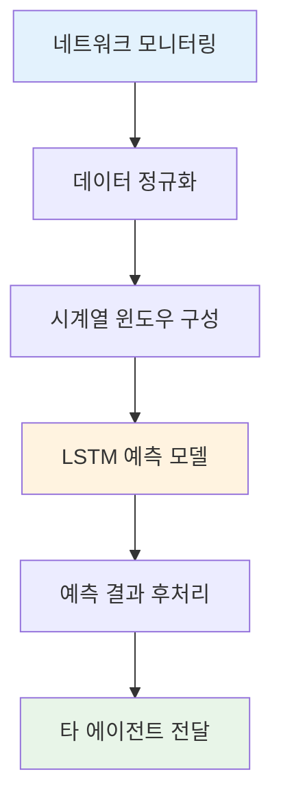

# 예측 AI 에이전트

> **LSTM 기반 시계열 예측을 통한 네트워크 상태 사전 감지 및 예방적 제어 시스템**

[](https://en.wikipedia.org/wiki/Long_short-term_memory)

## 1 목차

- [개요](#-개요)
- [기술적 핵심](#-기술적-핵심)
- [LSTM 아키텍처](#-lstm-아키텍처)
- [예측 메커니즘](#-예측-메커니즘)
- [데이터 처리 파이프라인](#-데이터-처리-파이프라인)
- [타 에이전트와의 연계](#-타-에이전트와의-연계)

## 2 개요

예측 AI 에이전트는 Agentic AI 네트워크 관리 시스템의 핵심 구성요소로서, LSTM(Long Short-Term Memory) 신경망을 기반으로 한 시계열 예측 모델을 구현한다. 본 에이전트는 실시간으로 수집되는 8차원 네트워크 메트릭 벡터를 입력으로 받아, 과거 50개 시점의 데이터 패턴을 학습하여 미래 30초간의 네트워크 상태를 예측한다.

### 2.1 **주요 기능**

- **시계열 패턴 학습**: 과거 n개(n≥50) 시점의 다차원 네트워크 데이터로부터 시간적 의존성 추출
- **실시간 예측**: 30초 후의 네트워크 상태를 10ms 이내에 예측
- **다차원 동시 예측**: RTT, 패킷 손실률, 대역폭 사용률 등 8개 메트릭 동시 처리
- **임계값 기반 알림**: 예측된 패킷 손실률이 임계값 초과 시 적응형 버퍼링 관리 모듈에 버퍼 확장 신호 전송

## 3 기술적 핵심

### 3.1 **입력 데이터 구조**

예측 AI 에이전트는 다음과 같은 8차원 네트워크 메트릭 벡터를 입력으로 받는다:

| 차원 | 메트릭 | 단위 | 기술적 의미 |
|------|--------|------|-------------|
| x₁ | Round Trip Time (RTT) | ms | 패킷 왕복 지연시간 |
| x₂ | Queue Length | count | 라우터 큐 대기 패킷 수 |
| x₃ | Packet Loss Rate | % | 패킷 유실률 |
| x₄ | Bandwidth Usage | % | 대역폭 활용률 |
| x₅ | Throughput | Mbps | 실제 데이터 처리량 |
| x₆ | CPU Usage | % | 네트워크 장비 CPU 사용률 |
| x₇ | Memory Usage | % | 네트워크 장비 메모리 사용률 |
| x₈ | Jitter | ms | 지연 변동성 |

### 3.2 **데이터 전처리**

#### 3.2.1 **정규화 과정**
수집된 원시 데이터는 각 메트릭의 스케일 차이를 보정하기 위해 표준화 과정을 적용한다. 예를 들어 RTT는 밀리초 단위(10~100ms), 대역폭은 퍼센트 단위(0~100%)로 측정되는데, 이러한 단위 차이를 없애기 위해 모든 값을 평균 0, 표준편차 1의 동일한 범위로 변환한다.

#### 3.2.2 **시계열 윈도우 구성**
슬라이딩 윈도우 기법을 사용하여 시간 t에서의 입력 시퀀스를 다음과 같이 구성한다:

```
X_t = [x_{t-49}, x_{t-48}, ..., x_{t-1}, x_t]
```

## 4 LSTM 아키텍처

### 4.1 **네트워크 구조**

LSTM 모델은 다음과 같은 계층 구조를 가진다:

```
입력층 (8×50) → LSTM층 (64개 뉴런) → 완전연결층 (8개 뉴런) → 출력층 (8×1)
```

### 4.2 **수학적 모델**

명세서에 정의된 LSTM 예측 공식을 기반으로 한다:

```
h_t = LSTM(x_t, h_{t-1})
y_t = W_h × h_t + b_h
```

여기서:
- `h_t`: 시간 t에서의 은닉 상태 벡터
- `x_t`: 시간 t에서의 입력 벡터 (8차원 네트워크 메트릭)
- `W_h`: 출력층 가중치 행렬
- `b_h`: 출력층 편향 벡터
- `y_t`: 예측된 네트워크 상태 벡터

### 4.3 **하이퍼파라미터 설정**

| 파라미터 | 값 | 설정 근거 |
|----------|-------|-----------|
| Window Size | 50 | 네트워크 패턴의 단기 주기성 고려 |
| Hidden Units | 64 | 복잡도와 계산 효율성의 균형점 |
| Learning Rate | 0.001 | 안정적 수렴을 위한 보수적 설정 |
| Dropout Rate | 0.2 | 과적합 방지 |
| Batch Size | 32 | 메모리 효율성과 학습 안정성 고려 |

## 5 예측 메커니즘

### 5.1 **예측 과정**

1. **데이터 수집**: 실시간 네트워크 모니터링 시스템으로부터 8차원 메트릭 수집
2. **전처리**: 정규화 및 시계열 윈도우 구성
3. **LSTM 순전파**: 과거 50개 시점 데이터를 통한 은닉 상태 계산
4. **예측값 산출**: 은닉 상태로부터 미래 30초 네트워크 상태 예측
5. **후처리**: 역정규화 및 물리적 제약 조건 적용

### 5.2 **예측 출력 구조**

예측 AI 에이전트는 다음과 같은 구조화된 예측 결과를 출력한다:

| 출력 항목 | 설명 | 비고 |
|----------|------|------|
| predicted_delay | 예측된 왕복 지연시간 | Delay |
| predicted_loss | 예측된 패킷 손실 비율(%) | Packet_Loss_Rate |
| predicted_congestion | 예측된 혼잡도 | Network_Congestion |
| predicted_bandwidth | 예측된 대역폭 사용률(%) | Bandwidth_Usage |
| reliability_score | 패킷 손실 기반 신뢰도 | Reliability_Score |
| predicted_throughput | 예측된 사용량(Mbps) | Total_Traffic |

## 6 데이터 처리 파이프라인

### 6.1 **실시간 처리 흐름**



### 6.2 **데이터 품질 관리**

#### 6.2.1 **이상치 탐지 및 처리**
사분위수 범위 방법을 사용하여 비정상적으로 높거나 낮은 값을 탐지한다. 전체 데이터를 4등분했을 때 25% 지점(Q1)과 75% 지점(Q3)을 기준으로, 정상 범위를 벗어나는 데이터를 이상치로 판단한다.

#### 6.2.2 **결측값 처리**
누락된 데이터는 전후 시점의 값을 이용한 선형 보간과 이동 평균 기법을 조합하여 추정한다.

### 6.3 **성능 최적화**

#### 6.3.1 **모델 경량화**
- **양자화**: 계산 정밀도를 32비트에서 16비트로 줄여 처리 속도 향상
- **가지치기**: 중요도가 낮은 신경망 연결을 제거하여 모델 크기 축소
- **배치 처리**: 여러 예측 요청을 한 번에 처리하여 전체 처리량 향상

#### 6.3.2 **메모리 관리**
- **순환 버퍼**: 고정 크기 메모리로 데이터 히스토리 관리
- **지연 로딩**: 필요 시점에만 모델 가중치 로드

## 7 타 에이전트와의 연계

### 7.1 **데이터 전달 메커니즘**

예측 AI 에이전트는 예측 결과를 다음 3개 에이전트에 특화된 형태로 전달한다:

#### 7.1.1 **→ 라우팅 AI 에이전트**

| 입력 항목 | 설명 | 비고 |
|----------|------|------|
| Delay (ms) | 예측된 경로 지연 시간 | - |
| Bandwidth Usage (0~1) | 예측된 링크 대역폭 사용률 | 정규화 |
| Reliability Score (0~1) | 경로 신뢰성 점수 | 정규화 |

#### 7.1.2 **→ 로드밸런싱 AI 에이전트**

| 입력 항목 | 설명 |
|----------|------|
| Capacity₍ᵢ₎ (Mbps) | 네트워크 장비 i가 처리할 수 있는 최대 트래픽량 |
| Current_Load₍ᵢ₎ (Mbps) | 네트워크 장비 i의 현재 트래픽 처리량 |
| Total_Traffic (Mbps) | 예측된 총 트래픽 |

#### 7.1.3 **→ 적응형 버퍼링 관리**

| 입력 항목 | 설명 | 비고 |
|----------|------|------|
| Packet Loss Rate (%) | 예측 패킷 손실률 | - |
| Network Congestion Level (0~1) | 예측 네트워크 혼잡 수준 | 정규화 |
| Predicted Delay (ms) | 예측 전송 지연 시간 | - |
| Predicted Throughput (kbps) | 예측 전송량 | - |

### 7.2  **중앙 제어와의 협력**

중앙 제어 모듈과의 피드백 루프를 통해 예측 성능을 지속적으로 개선한다:

1. **예측 제공**: 30초 후 네트워크 상태 예측
2. **실행 결과 수집**: 실제 네트워크 제어 결과 데이터
3. **정확도 평가**: 예측값과 실제값의 오차 분석  
4. **모델 업데이트**: 오차 기반 가중치 조정
